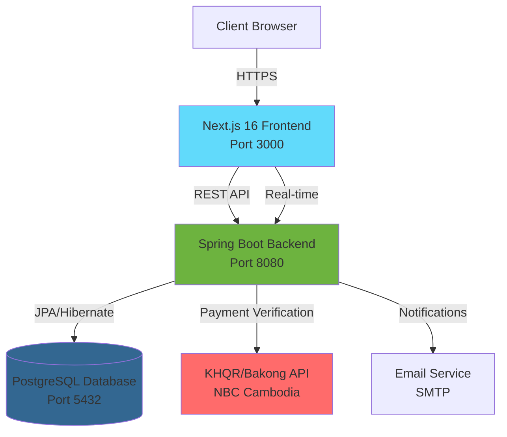
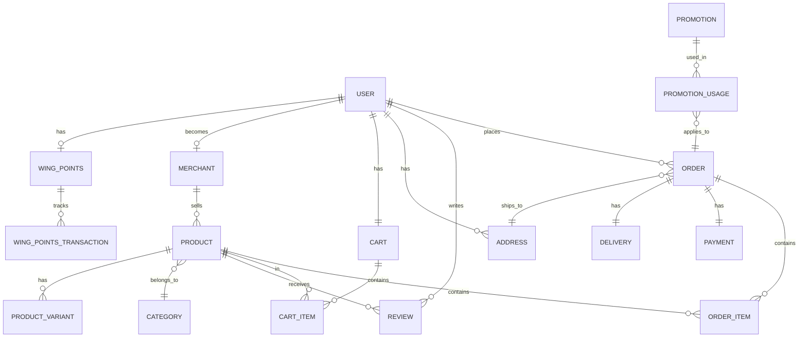

# Project Technical Documentation

**Project Name:** Wing E-commerce Platform  
**Version:** 0.0.1-SNAPSHOT  
**Last Updated:** February 5, 2026

---

## Table of Contents

1. [Cover Page](#cover-page)
2. [Project Overview](#project-overview)
3. [System Architecture](#system-architecture)
4. [Technology Stack](#technology-stack)
5. [Project Structure](#project-structure)
6. [Installation and Setup](#installation-and-setup)
7. [Configuration](#configuration)
8. [API Documentation](#api-documentation)
9. [Business Logic](#business-logic)
10. [Database Design](#database-design)
11. [Security](#security)
12. [Error Handling](#error-handling)
13. [Testing](#testing)
14. [Deployment](#deployment)
15. [Limitations and Future Improvements](#limitations-and-future-improvements)

---

## Cover Page

### Wing E-commerce Platform
**Full-Stack Web Application**

A modern, production-ready e-commerce platform built with Spring Boot and Next.js, featuring real-time updates, secure payment processing via KHQR (Cambodia's national QR payment system), and comprehensive user management.

**Target Users:**
- Customers: Browse products, place orders, track deliveries
- Merchants: Manage product listings and inventory
- Administrators: Full system control and analytics
- Delivery Drivers: Order fulfillment and tracking

**Document Purpose:**  
This document provides comprehensive technical specifications for developers, architects, and technical reviewers working on or evaluating the Wing E-commerce Platform.

---

## Project Overview

### Purpose
The Wing E-commerce Platform addresses the need for a localized, secure e-commerce solution in Cambodia with native support for KHQR payments, multi-merchant capabilities, and real-time order tracking.

### Key Differentiators
- Native KHQR/Bakong API integration for local payment processing
- JWT-based authentication with token blacklisting
- Real-time cart synchronization via WebSockets
- Multi-merchant support with isolated product catalogs
- Wing Points loyalty system
- Two-factor authentication (2FA) support
- Email verification and password reset flows

### Project Type
Full-stack web application with RESTful backend API and server-rendered frontend.

---

## System Architecture

### High-Level Architecture



### Architecture Pattern
**Monolithic Backend + Server-Side Rendered Frontend**

The backend follows a layered architecture:
- **Controller Layer**: REST endpoints and request validation
- **Service Layer**: Business logic and transaction management
- **Repository Layer**: Data access using Spring Data JPA
- **Security Layer**: JWT authentication and authorization

The frontend uses Next.js App Router with:
- **Server Components**: Data fetching and static rendering
- **Client Components**: Interactive UI and real-time features
- **Server Actions**: Form submissions and mutations
- **API Routes**: Webhook handlers

### Communication Flow

1. User interacts with Next.js frontend
2. Frontend calls Spring Boot REST API
3. JWT token validated via `JwtAuthenticationFilter`
4. Service layer executes business logic
5. Repository layer persists to PostgreSQL
6. Response returned to frontend
7. Real-time updates pushed via WebSockets (if applicable)

---

## Technology Stack

### Backend Technologies

| Component | Technology | Version | Purpose |
|-----------|-----------|---------|---------|
| Framework | Spring Boot | 4.0.2 | Application framework |
| Language | Java | 21 | Programming language |
| Database | PostgreSQL | Latest | Primary data store |
| ORM | Hibernate (JPA) | Included | Object-relational mapping |
| Security | Spring Security | 6.x | Authentication/Authorization |
| JWT | JJWT | 0.12.3 | Token generation/validation |
| Validation | Hibernate Validator | Included | Request validation |
| API Docs | SpringDoc OpenAPI | 3.0.0-M1 | Swagger UI |
| Cache | Caffeine | Latest | JWT blacklist caching |
| Payment SDK | KHQR SDK | 1.0.0.9 | Cambodia payment processing |
| 2FA | Google Authenticator | 1.5.0 | Two-factor authentication |
| Email | Spring Mail | Included | Email notifications |
| Build Tool | Maven | 3.x | Dependency management |

### Frontend Technologies

| Component | Technology | Version | Purpose |
|-----------|-----------|---------|---------|
| Framework | Next.js | 16.1.0 | React framework |
| Language | TypeScript | 5.x | Type-safe JavaScript |
| Runtime | React | 19.2.3 | UI library |
| Styling | Tailwind CSS | 4.x | Utility-first CSS |
| Animations | Framer Motion | 12.23.26 | UI animations |
| Animations | GSAP | 3.14.2 | Advanced animations |
| 3D Graphics | Three.js | 0.182.0 | WebGL rendering |
| UI Components | Radix UI | Various | Accessible primitives |
| Icons | Lucide React | 0.562.0 | Icon library |
| Forms | React Hook Form | 7.69.0 | Form management |
| Validation | Zod | 4.2.1 | Schema validation |
| HTTP Client | Axios | 1.13.4 | API requests |
| Real-time | Socket.IO Client | 4.8.1 | WebSocket communication |
| OAuth | React OAuth Google | 0.13.4 | Google Sign-In |
| Notifications | React Hot Toast | 2.6.0 | Toast notifications |
| Package Manager | pnpm | Latest | Dependency management |

### External Services

- **KHQR/Bakong API**: National Bank of Cambodia payment gateway
- **Google OAuth**: Third-party authentication
- **SMTP Server**: Email delivery (configurable)

---

## Project Structure

### Backend Structure (`ecommerce-backend-wing`)

```
ecommerce-backend-wing/
├── src/main/
│   ├── java/com/wing/ecommercebackendwing/
│   │   ├── config/              # Configuration classes
│   │   │   ├── AppConfig.java
│   │   │   ├── BakongConfig.java
│   │   │   ├── DatabaseSeeder.java
│   │   │   ├── OpenApiConfig.java
│   │   │   ├── RestClientConfig.java
│   │   │   └── WebConfig.java
│   │   ├── controller/          # REST API endpoints (16 controllers)
│   │   │   ├── AuthController.java
│   │   │   ├── ProductController.java
│   │   │   ├── OrderController.java
│   │   │   ├── CartController.java
│   │   │   ├── PaymentController.java
│   │   │   └── ...
│   │   ├── dto/                 # Data Transfer Objects
│   │   │   ├── request/         # Request DTOs
│   │   │   ├── response/        # Response DTOs
│   │   │   └── mapper/          # Entity-DTO MapStruct mappers
│   │   ├── exception/           # Custom exceptions
│   │   │   ├── custom/          # Domain-specific exceptions
│   │   │   ├── ErrorCode.java
│   │   │   └── GlobalExceptionHandler.java
│   │   ├── model/               # Domain models
│   │   │   ├── entity/          # JPA entities (20 entities)
│   │   │   └── enums/           # Enumerations
│   │   ├── repository/          # Spring Data JPA repositories (20 repos)
│   │   ├── security/            # Security configuration
│   │   │   ├── jwt/             # JWT implementation
│   │   │   ├── SecurityConfig.java
│   │   │   └── CustomUserDetailsService.java
│   │   ├── service/             # Business logic layer (22 services)
│   │   └── util/                # Utility classes
│   └── resources/
│       ├── application.properties
│       ├── application-dev.properties
│       ├── application-prod.properties
│       └── static/
└── pom.xml                      # Maven dependencies
```

### Frontend Structure (`ecommerce-frontend`)

```
ecommerce-frontend/
├── src/
│   ├── app/                     # Next.js App Router
│   │   ├── (auth)/              # Authentication routes
│   │   │   ├── login/
│   │   │   └── register/
│   │   ├── (shop)/              # Shopping routes
│   │   │   ├── products/
│   │   │   ├── cart/
│   │   │   ├── checkout/
│   │   │   └── orders/
│   │   ├── (info)/              # Static pages
│   │   │   └── about/
│   │   └── api/                 # API route handlers
│   ├── actions/                 # Server Actions
│   │   ├── auth.actions.ts
│   │   ├── product.actions.ts
│   │   ├── cart.actions.ts
│   │   └── order.actions.ts
│   ├── components/              # React components
│   │   ├── ui/                  # Reusable UI primitives
│   │   ├── common/              # Layout components
│   │   ├── products/            # Product-specific components
│   │   ├── cart/                # Cart components
│   │   └── checkout/            # Checkout components
│   ├── hooks/                   # Custom React hooks
│   ├── services/                # API client services (18 services)
│   │   ├── client.ts            # Axios instance configuration
│   │   ├── auth.service.ts
│   │   ├── product.service.ts
│   │   └── ...
│   ├── types/                   # TypeScript type definitions
│   ├── utils/                   # Utility functions
│   ├── validations/             # Zod schemas
│   └── styles/                  # Global styles
├── public/                      # Static assets
├── package.json
└── tsconfig.json
```

---

## Installation and Setup

### Prerequisites

**Backend:**
- Java JDK 21 or higher
- Maven 3.8+
- PostgreSQL 14+

**Frontend:**
- Node.js 20+
- pnpm (recommended) or npm

### Backend Setup

1. **Clone the repository**
```bash
git clone <repository-url>
cd full-stack-wing-project/ecommerce-backend-wing
```

2. **Configure database**
```bash
# Create PostgreSQL database
psql -U postgres
CREATE DATABASE ecommerce_db;
```

3. **Configure environment**

Edit [src/main/resources/application-dev.properties](file:///e:/full-stack-wing-project/ecommerce-backend-wing/src/main/resources/application-dev.properties):
```properties
spring.datasource.url=jdbc:postgresql://localhost:5432/ecommerce_db
spring.datasource.username=your_username
spring.datasource.password=your_password
```

4. **Build the project**
```bash
mvn clean install
```

5. **Run the application**
```bash
mvn spring-boot:run
```

Backend will start on `http://localhost:8080`

### Frontend Setup

1. **Navigate to frontend directory**
```bash
cd ../ecommerce-frontend
```

2. **Install dependencies**
```bash
pnpm install
```

3. **Configure environment**

Create [.env.local](file:///e:/full-stack-wing-project/ecommerce-frontend/.env.local):
```env
NEXT_PUBLIC_API_URL=http://localhost:8080/api
GOOGLE_CLIENT_ID=your_google_client_id
GOOGLE_CLIENT_SECRET=your_google_client_secret
```

4. **Run development server**
```bash
pnpm run dev
```

Frontend will start on `http://localhost:3000`

### Verify Installation

1. Access Swagger UI: `http://localhost:8080/swagger-ui.html`
2. Access Frontend: `http://localhost:3000`
3. Test health endpoint: `http://localhost:8080/api/health`

---

## Configuration

### Backend Configuration

**Profile-Based Configuration:**

The application uses Spring profiles for environment-specific settings:

- [application.properties](file:///e:/full-stack-wing-project/ecommerce-backend-wing/src/main/resources/application.properties) - Common settings and active profile
- [application-dev.properties](file:///e:/full-stack-wing-project/ecommerce-backend-wing/src/main/resources/application-dev.properties) - Development configuration
- [application-prod.properties](file:///e:/full-stack-wing-project/ecommerce-backend-wing/src/main/resources/application-prod.properties) - Production configuration

**Key Configuration Properties:**

```properties
# Server
server.port=8080

# Database
spring.datasource.url=jdbc:postgresql://localhost:5432/ecommerce_db
spring.jpa.hibernate.ddl-auto=update
spring.jpa.show-sql=true

# JWT
jwt.secret=${JWT_SECRET}
jwt.access-token.expiration=3600000  # 1 hour
jwt.refresh-token.expiration=9000000  # 2.5 hours

# KHQR/Bakong
khqr.api-token=${KHQR_API_TOKEN}
khqr.api-base-url=https://api-bakong.nbc.gov.kh
khqr.merchant.bakong-id=merchant@bkrt
khqr.merchant.name=MyStore

# CORS
cors.allowed-origins=http://localhost:3000

# Email
spring.mail.host=${SPRING_MAIL_HOST}
spring.mail.port=587
spring.mail.username=${SPRING_MAIL_USERNAME}
spring.mail.password=${SPRING_MAIL_PASSWORD}

# Security
security.account-lockout.max-attempts=5
security.account-lockout.duration-minutes=30
security.email-verification.enabled=true

# Google OAuth
spring.security.oauth2.client.registration.google.client-id=${GOOGLE_CLIENT_ID}
spring.security.oauth2.client.registration.google.client-secret=${GOOGLE_CLIENT_SECRET}
```

### Frontend Configuration

**Environment Variables (.env.local):**

```env
# API Configuration
NEXT_PUBLIC_API_URL=http://localhost:8080/api

# Google OAuth
GOOGLE_CLIENT_ID=your_google_client_id
GOOGLE_CLIENT_SECRET=your_google_client_secret
```

**Next.js Configuration (next.config.ts):**

```typescript
const nextConfig = {
  images: {
    remotePatterns: [
      { protocol: 'https', hostname: '**' }
    ]
  },
  experimental: {
    serverActions: true
  }
}
```

---

## API Documentation

### Base URL
```
Development: http://localhost:8080/api
Production: https://api.example.com/api
```

### Authentication Endpoints

#### Register New User
```http
POST /api/auth/register
Content-Type: application/json

{
  "email": "user@example.com",
  "password": "SecurePass123!",
  "firstName": "John",
  "lastName": "Doe",
  "phone": "+855123456789"
}

Response 201 Created:
{
  "accessToken": "eyJhbGciOiJIUzI1NiIs...",
  "refreshToken": "eyJhbGciOiJIUzI1NiIs...",
  "tokenType": "Bearer",
  "expiresIn": 3600,
  "user": {
    "id": "550e8400-e29b-41d4-a716-446655440000",
    "email": "user@example.com",
    "firstName": "John",
    "lastName": "Doe",
    "role": "USER"
  }
}
```

#### Login
```http
POST /api/auth/login
Content-Type: application/json

{
  "email": "user@example.com",
  "password": "SecurePass123!"
}

Response 200 OK:
{
  "accessToken": "eyJhbGciOiJIUzI1NiIs...",
  "refreshToken": "eyJhbGciOiJIUzI1NiIs...",
  "tokenType": "Bearer",
  "expiresIn": 3600,
  "user": {
    "id": "550e8400-e29b-41d4-a716-446655440000",
    "email": "user@example.com",
    "role": "USER",
    "emailVerified": true
  }
}
```

#### Refresh Token
```http
POST /api/auth/refresh
Content-Type: application/json

{
  "refreshToken": "eyJhbGciOiJIUzI1NiIs..."
}

Response 200 OK:
{
  "accessToken": "eyJhbGciOiJIUzI1NiIs...",
  "refreshToken": "eyJhbGciOiJIUzI1NiIs...",
  "expiresIn": 3600
}
```

#### Logout
```http
POST /api/auth/logout
Authorization: Bearer {accessToken}

Response 200 OK:
{
  "message": "Logged out successfully"
}
```

### Product Endpoints

#### Get All Products
```http
GET /api/products?page=1&limit=20&category=electronics&sort=price_asc

Response 200 OK:
{
  "products": [
    {
      "id": "123e4567-e89b-12d3-a456-426614174000",
      "name": "Wireless Headphones",
      "slug": "wireless-headphones",
      "description": "Premium noise-cancelling headphones",
      "price": 199.99,
      "comparePrice": 249.99,
      "stock": 45,
      "images": ["https://example.com/image1.jpg"],
      "category": {
        "id": "cat-123",
        "name": "Electronics",
        "slug": "electronics"
      },
      "rating": 4.5,
      "reviewCount": 128,
      "isFeatured": true,
      "isActive": true
    }
  ],
  "pagination": {
    "page": 1,
    "limit": 20,
    "total": 150,
    "totalPages": 8
  }
}
```

#### Get Product by Slug
```http
GET /api/products/wireless-headphones

Response 200 OK:
{
  "id": "123e4567-e89b-12d3-a456-426614174000",
  "name": "Wireless Headphones",
  "slug": "wireless-headphones",
  "description": "Premium noise-cancelling headphones with 30-hour battery",
  "price": 199.99,
  "comparePrice": 249.99,
  "stock": 45,
  "images": ["https://example.com/image1.jpg", "https://example.com/image2.jpg"],
  "category": {
    "id": "cat-123",
    "name": "Electronics"
  },
  "merchant": {
    "id": "merchant-123",
    "name": "TechStore"
  },
  "rating": 4.5,
  "reviewCount": 128,
  "reviews": [],
  "variants": [],
  "createdAt": "2026-01-15T10:30:00Z"
}
```

### Cart Endpoints

#### Get User Cart
```http
GET /api/cart
Authorization: Bearer {accessToken}

Response 200 OK:
{
  "id": "cart-123",
  "userId": "user-456",
  "items": [
    {
      "id": "item-1",
      "product": {
        "id": "prod-123",
        "name": "Wireless Headphones",
        "price": 199.99,
        "images": ["https://example.com/image1.jpg"]
      },
      "quantity": 2,
      "subtotal": 399.98
    }
  ],
  "subtotal": 399.98,
  "tax": 39.99,
  "total": 439.97,
  "itemCount": 2
}
```

#### Add to Cart
```http
POST /api/cart/add
Authorization: Bearer {accessToken}
Content-Type: application/json

{
  "productId": "123e4567-e89b-12d3-a456-426614174000",
  "quantity": 2
}

Response 200 OK:
{
  "id": "item-1",
  "product": {
    "id": "123e4567-e89b-12d3-a456-426614174000",
    "name": "Wireless Headphones",
    "price": 199.99
  },
  "quantity": 2,
  "subtotal": 399.98
}
```

### Order Endpoints

#### Create Order
```http
POST /api/orders
Authorization: Bearer {accessToken}
Content-Type: application/json

{
  "items": [
    {
      "productId": "123e4567-e89b-12d3-a456-426614174000",
      "quantity": 2
    }
  ],
  "deliveryAddress": {
    "street": "123 Main St",
    "city": "Phnom Penh",
    "province": "Phnom Penh",
    "postalCode": "12000",
    "country": "Cambodia"
  },
  "paymentMethod": "KHQR",
  "deliveryInstructions": "Call upon arrival"
}

Response 201 Created:
{
  "orderId": "order-789",
  "orderNumber": "ORD-20260205-1234",
  "status": "PENDING",
  "total": 439.97,
  "paymentMethod": "KHQR",
  "qrCode": "data:image/png;base64,iVBORw0KGgoAAAANS...",
  "qrString": "khqr://...",
  "expiresAt": "2026-02-05T10:45:00Z",
  "createdAt": "2026-02-05T10:30:00Z"
}
```

#### Get User Orders
```http
GET /api/orders?status=PENDING&page=1&limit=10
Authorization: Bearer {accessToken}

Response 200 OK:
{
  "orders": [
    {
      "id": "order-789",
      "orderNumber": "ORD-20260205-1234",
      "status": "PENDING",
      "total": 439.97,
      "items": [
        {
          "productName": "Wireless Headphones",
          "quantity": 2,
          "price": 199.99
        }
      ],
      "createdAt": "2026-02-05T10:30:00Z"
    }
  ],
  "pagination": {
    "page": 1,
    "limit": 10,
    "total": 5,
    "totalPages": 1
  }
}
```

### Payment Endpoints

#### Generate KHQR Code
```http
POST /api/payments/khqr/generate
Authorization: Bearer {accessToken}
Content-Type: application/json

{
  "orderId": "order-789",
  "amount": 439.97
}

Response 200 OK:
{
  "qrCode": "data:image/png;base64,iVBORw0KGgoAAAANS...",
  "qrString": "khqr://payment?...",
  "transactionId": "txn-456",
  "expiresAt": "2026-02-05T10:45:00Z",
  "amount": 439.97
}
```

#### Verify Payment (MD5 Hash)
```http
POST /api/payments/verify/md5
Content-Type: application/json

{
  "hash": "5d41402abc4b2a76b9719d911017c592",
  "orderId": "order-789"
}

Response 200 OK:
{
  "verified": true,
  "transactionId": "txn-456",
  "status": "COMPLETED",
  "amount": 439.97,
  "paidAt": "2026-02-05T10:35:00Z"
}
```

### Admin Endpoints

#### Get All Users (Admin Only)
```http
GET /api/admin/users?page=1&limit=50
Authorization: Bearer {adminAccessToken}

Response 200 OK:
{
  "users": [
    {
      "id": "user-123",
      "email": "user@example.com",
      "role": "USER",
      "isActive": true,
      "emailVerified": true,
      "createdAt": "2026-01-01T00:00:00Z"
    }
  ],
  "pagination": {
    "page": 1,
    "limit": 50,
    "total": 250
  }
}
```

### Error Responses

All error responses follow this format:

```json
{
  "timestamp": "2026-02-05T10:30:00Z",
  "status": 400,
  "error": "Bad Request",
  "message": "Validation failed",
  "path": "/api/auth/register",
  "errors": [
    {
      "field": "email",
      "message": "Email is required"
    }
  ]
}
```

**Common HTTP Status Codes:**

- `200 OK` - Request successful
- `201 Created` - Resource created successfully
- `400 Bad Request` - Invalid request data
- `401 Unauthorized` - Missing or invalid authentication
- `403 Forbidden` - Insufficient permissions
- `404 Not Found` - Resource not found
- `409 Conflict` - Resource already exists
- `500 Internal Server Error` - Server error

---

## Business Logic

### Authentication Flow

1. **User Registration:**
   - Validate email uniqueness
   - Hash password using BCrypt
   - Generate email verification token
   - Send verification email
   - Create user with `emailVerified=false`
   - Return JWT access and refresh tokens

2. **Email Verification:**
   - User clicks link in email
   - Token validated
   - User's `emailVerified` set to `true`

3. **Login:**
   - Validate credentials
   - Check account lock status
   - Increment failed attempts on wrong password
   - Lock account after 5 failed attempts for 30 minutes
   - Generate JWT tokens on success
   - Reset failed login attempts

4. **Token Refresh:**
   - Validate refresh token
   - Check token expiration
   - Generate new access token
   - Optionally rotate refresh token

5. **Logout:**
   - Add access token to blacklist cache
   - Delete refresh token from database
   - Token invalid for future requests

6. **Google OAuth:**
   - User initiates Google Sign-In
   - Verify Google ID token
   - Check if user exists by `googleId`
   - Create new user or link existing user
   - Generate JWT tokens

### Order Creation Flow

1. **Validation:**
   - Verify user authentication
   - Validate payment method (KHQR, CASH_ON_DELIVERY)
   - Validate delivery address
   - Check product availability and stock

2. **Order Processing:**
   - Generate unique order number (ORD-YYYYMMDD-XXXX)
   - Calculate subtotal from cart items
   - Calculate delivery fee based on distance/zone
   - Apply discount if promotion code provided
   - Calculate tax (configurable percentage)
   - Calculate total amount

3. **Stock Management:**
   - Reserve stock for each product
   - Create order items with snapshot of product details
   - Decrement product stock quantities

4. **Payment Initiation:**
   - If KHQR: Generate QR code via Bakong API
   - If COD: Mark as pending payment
   - Create Payment record with status

5. **Order Confirmation:**
   - Set order status to PENDING
   - Send order confirmation email
   - Return order details with payment info

### Payment Verification Flow (KHQR)

1. **Payment Callback:**
   - Bakong sends webhook to `/api/payments/verify/md5`
   - Verify MD5 hash authenticity
   - Extract transaction details

2. **Order Update:**
   - Find order by transaction reference
   - Update payment status to COMPLETED
   - Update order status to CONFIRMED
   - Record payment timestamp

3. **Post-Payment Actions:**
   - Award Wing Points to customer
   - Send payment confirmation email
   - Trigger order fulfillment workflow
   - Notify merchant

### Product Search and Filtering

Supports multiple filter criteria:
- **Category**: Filter by category slug
- **Price Range**: Min/max price filtering
- **Featured**: Show only featured products
- **Sale**: Products with `comparePrice > price`
- **Sorting**: newest, price_asc, price_desc, rating
- **Pagination**: Page-based with configurable limit

### Role-Based Access Control

**Roles:**
- `USER`: Standard customer access
- `ADMIN`: Full system access
- `MERCHANT`: Manage own products
- `DRIVER`: Delivery management

**Permission Matrix:**

| Resource | USER | ADMIN | MERCHANT | DRIVER |
|----------|------|-------|----------|--------|
| View Products | ✓ | ✓ | ✓ | ✓ |
| Create Product | ✗ | ✓ | ✓ (own) | ✗ |
| Manage Cart | ✓ | ✓ | ✓ | ✗ |
| Create Order | ✓ | ✓ | ✓ | ✗ |
| View All Orders | ✗ | ✓ | ✓ (own) | ✓ (assigned) |
| Manage Users | ✗ | ✓ | ✗ | ✗ |
| View Analytics | ✗ | ✓ | ✓ (own) | ✗ |

---

## Database Design

### Entity-Relationship Diagram



### Core Tables

#### users
Primary user account table supporting both local and OAuth authentication.

| Column | Type | Constraints | Description |
|--------|------|-------------|-------------|
| id | UUID | PK | Primary key |
| email | VARCHAR(255) | UNIQUE, NOT NULL | User email |
| phone | VARCHAR(50) | UNIQUE | Phone number |
| google_id | VARCHAR(255) | UNIQUE | Google OAuth ID |
| auth_provider | ENUM | NOT NULL, DEFAULT 'LOCAL' | Authentication method |
| password | VARCHAR(255) | | Hashed password (nullable for OAuth) |
| first_name | VARCHAR(100) | NOT NULL | First name |
| last_name | VARCHAR(100) | NOT NULL | Last name |
| role | ENUM | NOT NULL, DEFAULT 'USER' | User role |
| avatar | VARCHAR(255) | | Profile picture URL |
| is_active | BOOLEAN | NOT NULL, DEFAULT true | Account status |
| email_verified | BOOLEAN | DEFAULT false | Email verification status |
| email_verification_token | VARCHAR(255) | | Verification token |
| account_locked | BOOLEAN | DEFAULT false | Lock status |
| locked_until | TIMESTAMP | | Unlock timestamp |
| failed_login_attempts | INTEGER | DEFAULT 0 | Failed login counter |
| twofa_enabled | BOOLEAN | DEFAULT false | 2FA status |
| twofa_secret | VARCHAR(255) | | 2FA secret key |
| password_reset_token | VARCHAR(255) | | Reset token |
| password_reset_token_expiry | TIMESTAMP | | Token expiration |
| created_at | TIMESTAMP | NOT NULL | Creation timestamp |
| updated_at | TIMESTAMP | NOT NULL | Last update timestamp |

**Indexes:**
- `idx_email` on `email`
- `idx_google_id` on `google_id`
- `idx_phone` on `phone`

#### products
Product catalog with pricing and inventory management.

| Column | Type | Constraints | Description |
|--------|------|-------------|-------------|
| id | UUID | PK | Primary key |
| merchant_id | UUID | FK → merchants | Merchant owner |
| category_id | UUID | FK → categories, NOT NULL | Product category |
| name | VARCHAR(255) | NOT NULL | Product name |
| slug | VARCHAR(255) | UNIQUE, NOT NULL | URL-friendly identifier |
| description | TEXT | | Product description |
| price | DECIMAL(10,2) | NOT NULL | Selling price |
| compare_price | DECIMAL(10,2) | | Original price (for sale) |
| cost_price | DECIMAL(10,2) | | Cost to merchant |
| stock_quantity | INTEGER | NOT NULL, DEFAULT 0 | Available stock |
| low_stock_threshold | INTEGER | DEFAULT 10 | Reorder threshold |
| images | TEXT | | JSON array of image URLs |
| is_active | BOOLEAN | NOT NULL, DEFAULT true | Visibility status |
| is_featured | BOOLEAN | DEFAULT false | Featured product flag |
| weight | DECIMAL(10,2) | | Product weight (kg) |
| dimensions | VARCHAR(100) | | Dimensions (LxWxH) |
| sku | VARCHAR(100) | | Stock keeping unit |
| barcode | VARCHAR(100) | | Barcode number |
| rating | DECIMAL(3,2) | DEFAULT 0 | Average rating |
| review_count | INTEGER | DEFAULT 0 | Total reviews |
| sold_count | INTEGER | DEFAULT 0 | Total sold |
| view_count | INTEGER | DEFAULT 0 | Total views |
| created_at | TIMESTAMP | NOT NULL | Creation timestamp |
| updated_at | TIMESTAMP | NOT NULL | Last update timestamp |

**Indexes:**
- `idx_slug` on `slug`
- `idx_category` on `category_id`
- `idx_merchant` on `merchant_id`
- `idx_active_featured` on `is_active, is_featured`

#### orders
Customer orders with fulfillment tracking.

| Column | Type | Constraints | Description |
|--------|------|-------------|-------------|
| id | UUID | PK | Primary key |
| order_number | VARCHAR(50) | UNIQUE, NOT NULL | Human-readable order ID |
| user_id | UUID | FK → users, NOT NULL | Customer |
| merchant_id | UUID | FK → merchants, NOT NULL | Fulfilling merchant |
| order_date | TIMESTAMP | NOT NULL | Order placement time |
| status | ENUM | NOT NULL, DEFAULT 'PENDING' | Order status |
| subtotal | DECIMAL(10,2) | NOT NULL | Items subtotal |
| delivery_fee | DECIMAL(10,2) | NOT NULL, DEFAULT 0 | Shipping cost |
| discount | DECIMAL(10,2) | DEFAULT 0 | Applied discount |
| tax | DECIMAL(10,2) | DEFAULT 0 | Tax amount |
| total | DECIMAL(10,2) | NOT NULL | Final total |
| delivery_address_id | UUID | FK → addresses, NOT NULL | Shipping address |
| delivery_instructions | TEXT | | Special instructions |
| estimated_delivery_time | TIMESTAMP | | ETA |
| delivered_at | TIMESTAMP | | Actual delivery time |
| cancelled_at | TIMESTAMP | | Cancellation time |
| cancel_reason | TEXT | | Cancellation reason |
| created_at | TIMESTAMP | NOT NULL | Creation timestamp |
| updated_at | TIMESTAMP | NOT NULL | Last update timestamp |

**Order Status Enum:** PENDING, CONFIRMED, PROCESSING, SHIPPED, DELIVERED, CANCELLED

**Indexes:**
- `idx_order_number` on `order_number`
- `idx_user` on `user_id`
- `idx_status` on `status`
- `idx_order_date` on `order_date`

#### payments
Payment records linked to orders.

| Column | Type | Constraints | Description |
|--------|------|-------------|-------------|
| id | UUID | PK | Primary key |
| order_id | UUID | FK → orders, UNIQUE, NOT NULL | Associated order |
| payment_method | ENUM | NOT NULL | Payment method |
| payment_status | ENUM | NOT NULL, DEFAULT 'PENDING' | Payment status |
| amount | DECIMAL(10,2) | NOT NULL | Payment amount |
| transaction_id | VARCHAR(255) | UNIQUE | External transaction ID |
| qr_code | TEXT | | Generated QR code (KHQR) |
| qr_string | TEXT | | QR code string |
| md5_hash | VARCHAR(255) | | Verification hash |
| expires_at | TIMESTAMP | | QR code expiration |
| paid_at | TIMESTAMP | | Payment completion time |
| created_at | TIMESTAMP | NOT NULL | Creation timestamp |
| updated_at | TIMESTAMP | NOT NULL | Last update timestamp |

**Payment Method Enum:** KHQR, CASH_ON_DELIVERY

**Payment Status Enum:** PENDING, COMPLETED, FAILED, REFUNDED

**Indexes:**
- `idx_order` on `order_id`
- `idx_transaction` on `transaction_id`
- `idx_status` on `payment_status`

### Relationships Summary

- **One-to-Many:**
  - User → Orders
  - User → Reviews
  - User → Addresses
  - Product → OrderItems
  - Product → CartItems
  - Order → OrderItems
  - Cart → CartItems

- **One-to-One:**
  - User → Cart
  - User → WingPoints
  - User → Merchant
  - Order → Payment
  - Order → Delivery

- **Many-to-One:**
  - Product → Category
  - Product → Merchant
  - Order → Address
  - Review → Product
  - Review → User

---

## Security

### Authentication Mechanism

**JWT (JSON Web Tokens)**

The system uses stateless JWT authentication with two token types:

1. **Access Token**
   - Expiration: 1 hour
   - Used for API authentication
   - Contains user ID, email, role
   - Sent in `Authorization: Bearer <token>` header

2. **Refresh Token**
   - Expiration: 2.5 hours
   - Stored in database (`refresh_tokens` table)
   - Used to obtain new access tokens
   - Single-use (deleted after refresh)

**Token Structure:**

```json
{
  "sub": "user-uuid",
  "email": "user@example.com",
  "role": "USER",
  "jti": "token-unique-id",
  "iat": 1738742400,
  "exp": 1738746000
}
```

### Token Blacklist

Logged-out access tokens are added to an in-memory Caffeine cache:
- Cache duration: Matches token expiration
- Prevents token reuse after logout
- Checked on every authenticated request
- Automatic cleanup on expiration

Implementation: `TokenBlacklistService.java`

### Password Security

**Hashing:**
- Algorithm: BCrypt
- Default cost factor: 10
- Salted automatically

**Password Requirements:**
- Minimum 8 characters
- At least one uppercase letter
- At least one lowercase letter
- At least one digit
- At least one special character

Validation enforced in `PasswordValidator.java`

### Request Security

**CORS Configuration:**

Allows requests from:
- `http://localhost:*`
- `http://127.0.0.1:*`
- `http://192.168.*.*` (local network)
- `https://*.ngrok-free.app` (development tunnels)

Credentials allowed: `true`

**Security Headers:**

```
Content-Security-Policy: default-src 'self'
X-Frame-Options: DENY
Strict-Transport-Security: max-age=31536000; includeSubDomains
```

### SQL Injection Prevention

- **Spring Data JPA:** Parameterized queries by default
- **Native queries:** Always use `@Param` bindings
- No string concatenation in JPQL queries

### XSS Prevention

- Input validation using Hibernate Validator
- Output encoding in frontend (React escapes by default)
- CSP headers prevent inline script execution

### CSRF Protection

Disabled for stateless API (`csrf().disable()`) as JWT is immune to CSRF attacks when stored in memory (not cookies).

### Rate Limiting

Account lockout after failed login attempts:
- Max attempts: 5
- Lockout duration: 30 minutes
- Automatic unlock after duration
- Manual unlock by admin

### Authorization Model

**Method-Level Security:**

Uses `@PreAuthorize` annotations:

```java
@PreAuthorize("hasRole('ADMIN')")
public void deleteUser(UUID userId) { ... }

@PreAuthorize("hasAnyRole('USER', 'ADMIN')")
public Cart getCart() { ... }
```

**Resource Ownership Validation:**

Services verify user owns resource before modification:

```java
if (!order.getUser().getId().equals(currentUserId)) {
    throw new ForbiddenException("Cannot access this order");
}
```

### Sensitive Data Protection

**Environment Variables:**
- JWT secret
- Database credentials
- Email credentials
- KHQR API token
- Google OAuth credentials

**Never Exposed:**
- Password hashes
- 2FA secrets
- Email verification tokens
- Password reset tokens

### API Security Best Practices

1. **Authentication Required:** All sensitive endpoints require valid JWT
2. **Role-Based Access:** Admin/Merchant endpoints check roles
3. **Input Validation:** All DTOs validated using `@Valid`
4. **Output Filtering:** Sensitive fields excluded from responses
5. **Error Handling:** Generic error messages (no stack traces in production)

---

## Error Handling

### Global Exception Handler

Centralized error handling via `@RestControllerAdvice`:

```java
@RestControllerAdvice
public class GlobalExceptionHandler {
    
    @ExceptionHandler(ResourceNotFoundException.class)
    public ResponseEntity<ErrorResponse> handleNotFound(ResourceNotFoundException ex) {
        return ResponseEntity.status(404).body(
            ErrorResponse.builder()
                .timestamp(Instant.now())
                .status(404)
                .error("Not Found")
                .message(ex.getMessage())
                .build()
        );
    }
}
```

### Custom Exceptions

| Exception | HTTP Status | Usage |
|-----------|-------------|-------|
| `ResourceNotFoundException` | 404 | Entity not found in database |
| `BadRequestException` | 400 | Invalid request data |
| `UnauthorizedException` | 401 | Missing/invalid authentication |
| `ForbiddenException` | 403 | Insufficient permissions |
| `TokenRefreshException` | 401 | Refresh token invalid/expired |

### Validation Errors

Bean validation errors return structured response:

```json
{
  "timestamp": "2026-02-05T10:30:00Z",
  "status": 400,
  "error": "Bad Request",
  "message": "Validation failed",
  "errors": [
    {
      "field": "email",
      "rejectedValue": "invalid",
      "message": "Email must be valid"
    },
    {
      "field": "password",
      "rejectedValue": null,
      "message": "Password must be at least 8 characters"
    }
  ]
}
```

### Database Errors

- **Unique Constraint Violation:** Mapped to 409 Conflict
- **Foreign Key Violation:** Mapped to 400 Bad Request
- **Transaction Timeout:** Mapped to 500 Internal Server Error

### Frontend Error Handling

**Axios Interceptor:**

```typescript
axiosInstance.interceptors.response.use(
  response => response,
  error => {
    if (error.response?.status === 401) {
      // Token expired - redirect to login
      window.location.href = '/login';
    }
    return Promise.reject(error);
  }
);
```

**User-Friendly Messages:**

Toast notifications display user-friendly errors instead of raw API messages.

---

## Testing

### Backend Testing

**Test Structure:**

```
src/test/java/com/wing/ecommercebackendwing/
└── service/
    └── PaymentServiceTest.java
```

**Unit Tests:**

```java
@SpringBootTest
class PaymentServiceTest {
    
    @Autowired
    private PaymentService paymentService;
    
    @Test
    void testKHQRGeneration() {
        // Given
        Order order = createTestOrder();
        
        // When
        KHQRResponse response = paymentService.generateKHQR(order);
        
        // Then
        assertNotNull(response.getQrCode());
        assertEquals(order.getTotal(), response.getAmount());
    }
}
```

**Testing Tools:**
- JUnit 5
- Mockito
- Spring Boot Test
- H2 in-memory database (for testing)

### Frontend Testing

No test files currently implemented.

**Recommended Testing Stack:**
- Jest - Unit testing
- React Testing Library - Component testing
- Playwright - E2E testing

### Manual Testing

**Swagger UI:** `http://localhost:8080/swagger-ui.html`

Provides interactive API documentation and testing interface.

---

## Deployment

### Backend Deployment

**Docker Deployment (Recommended):**

1. **Build Docker Image:**

```bash
cd ecommerce-backend-wing
mvn clean package
docker build -t wing-ecommerce-backend:latest .
```

2. **Run Container:**

```bash
docker run -d \
  -p 8080:8080 \
  -e SPRING_PROFILES_ACTIVE=prod \
  -e DATABASE_URL=jdbc:postgresql://db:5432/ecommerce \
  -e JWT_SECRET=your_production_secret \
  -e KHQR_API_TOKEN=your_khqr_token \
  --name wing-backend \
  wing-ecommerce-backend:latest
```

**Traditional Deployment:**

1. **Build JAR:**
```bash
mvn clean package -DskipTests
```

2. **Run JAR:**
```bash
java -jar -Dspring.profiles.active=prod \
  target/ecommerce-backend-wing-0.0.1-SNAPSHOT.jar
```

**Environment Variables (Production):**

```bash
export SPRING_PROFILES_ACTIVE=prod
export DATABASE_URL=jdbc:postgresql://production-db:5432/ecommerce
export JWT_SECRET=<secure-random-string>
export JWT_ACCESS_EXPIRATION=3600000
export JWT_REFRESH_EXPIRATION=604800000
export KHQR_API_TOKEN=<production-token>
export KHQR_API_BASE_URL=https://api-bakong.nbc.gov.kh
export SPRING_MAIL_HOST=smtp.gmail.com
export SPRING_MAIL_USERNAME=noreply@example.com
export SPRING_MAIL_PASSWORD=<app-password>
export GOOGLE_CLIENT_ID=<production-client-id>
export GOOGLE_CLIENT_SECRET=<production-client-secret>
```

### Frontend Deployment

**Vercel Deployment (Recommended):**

1. **Install Vercel CLI:**
```bash
npm i -g vercel
```

2. **Deploy:**
```bash
cd ecommerce-frontend
vercel --prod
```

3. **Set Environment Variables in Vercel Dashboard:**
- `NEXT_PUBLIC_API_URL`
- `GOOGLE_CLIENT_ID`
- `GOOGLE_CLIENT_SECRET`

**Docker Deployment:**

1. **Build Image:**
```bash
docker build -t wing-ecommerce-frontend:latest .
```

2. **Run Container:**
```bash
docker run -d \
  -p 3000:3000 \
  -e NEXT_PUBLIC_API_URL=https://api.example.com/api \
  --name wing-frontend \
  wing-ecommerce-frontend:latest
```

**Traditional Deployment:**

```bash
pnpm run build
pnpm run start
```

### Database Deployment

**Managed PostgreSQL (Recommended):**
- AWS RDS
- Google Cloud SQL
- Azure Database for PostgreSQL
- DigitalOcean Managed Databases

**Self-Hosted:**

```bash
docker run -d \
  -p 5432:5432 \
  -e POSTGRES_DB=ecommerce_db \
  -e POSTGRES_USER=ecommerce \
  -e POSTGRES_PASSWORD=<secure-password> \
  -v postgres-data:/var/lib/postgresql/data \
  --name postgres \
  postgres:16
```

### Production Checklist

- [ ] Set `spring.jpa.hibernate.ddl-auto=validate` (never use `update` in production)
- [ ] Enable database migrations (Flyway/Liquibase)
- [ ] Configure HTTPS/SSL certificates
- [ ] Set secure JWT secret (256-bit minimum)
- [ ] Enable security headers
- [ ] Configure SMTP for email
- [ ] Set up database backups
- [ ] Configure logging aggregation
- [ ] Set up monitoring (Prometheus/Grafana)
- [ ] Enable rate limiting
- [ ] Configure CDN for static assets
- [ ] Set up error tracking (Sentry)

---

## Limitations and Future Improvements

### Current Limitations

1. **Payment Methods:**
   - Only KHQR and Cash-on-Delivery supported
   - No credit card processing
   - No international payment gateways

2. **Scalability:**
   - Monolithic architecture limits horizontal scaling
   - Single database instance (no replication)
   - In-memory token blacklist not distributed

3. **Real-time Features:**
   - WebSocket implementation not yet complete
   - No live order tracking

4. **Search:**
   - Basic SQL filtering only
   - No full-text search
   - No elasticsearch integration

5. **File Storage:**
   - Product images stored as URLs (no upload functionality)
   - No CDN integration

6. **Multi-language:**
   - English only
   - No i18n support

7. **Inventory:**
   - No warehouse management
   - No multi-location stock tracking

8. **Testing:**
   - Limited unit test coverage
   - No integration tests
   - No E2E tests

### Planned Improvements

**Short-term (1-3 months):**

1. **Payment Enhancements:**
   - Add Stripe integration
   - Support credit/debit cards
   - Implement refund functionality

2. **Search Optimization:**
   - Integrate Elasticsearch
   - Add product search suggestions
   - Implement filters persistence

3. **Real-time Features:**
   - Complete WebSocket implementation
   - Live order status updates
   - Real-time inventory sync

4. **File Management:**
   - Add image upload endpoint
   - Integrate cloud storage (S3/Cloudinary)
   - Implement image optimization

**Medium-term (3-6 months):**

1. **Microservices Migration:**
   - Extract payment service
   - Extract notification service
   - Implement API gateway

2. **Performance:**
   - Add Redis caching layer
   - Implement database read replicas
   - CDN integration for static assets

3. **Analytics:**
   - Sales dashboard
   - Customer behavior tracking
   - Inventory forecasting

4. **Mobile App:**
   - React Native mobile application
   - Push notifications

**Long-term (6-12 months):**

1. **International Expansion:**
   - Multi-currency support
   - Multi-language (Khmer, Chinese)
   - International shipping

2. **Advanced Features:**
   - AI-powered product recommendations
   - Chatbot customer support
   - Voice search

3. **Scalability:**
   - Kubernetes orchestration
   - Auto-scaling infrastructure
   - Multi-region deployment

4. **Compliance:**
   - GDPR compliance tools
   - Advanced audit logging
   - Enhanced data privacy controls

---

## Appendix

### Technology Documentation Links

**Backend:**
- [Spring Boot Documentation](https://docs.spring.io/spring-boot/docs/current/reference/html/)
- [Spring Security Reference](https://docs.spring.io/spring-security/reference/)
- [PostgreSQL Documentation](https://www.postgresql.org/docs/)
- [KHQR SDK Documentation](https://bakong.nbc.gov.kh/)

**Frontend:**
- [Next.js Documentation](https://nextjs.org/docs)
- [React Documentation](https://react.dev/)
- [Tailwind CSS Documentation](https://tailwindcss.com/docs)
- [TypeScript Documentation](https://www.typescriptlang.org/docs/)

### Glossary

- **KHQR**: Khmer QR - Cambodia's national QR payment standard
- **Bakong**: National Bank of Cambodia's payment system
- **JWT**: JSON Web Token - authentication standard
- **2FA**: Two-Factor Authentication
- **ORM**: Object-Relational Mapping
- **DTO**: Data Transfer Object
- **JPA**: Java Persistence API
- **SSR**: Server-Side Rendering
- **CSP**: Content Security Policy

---

**End of Document**
