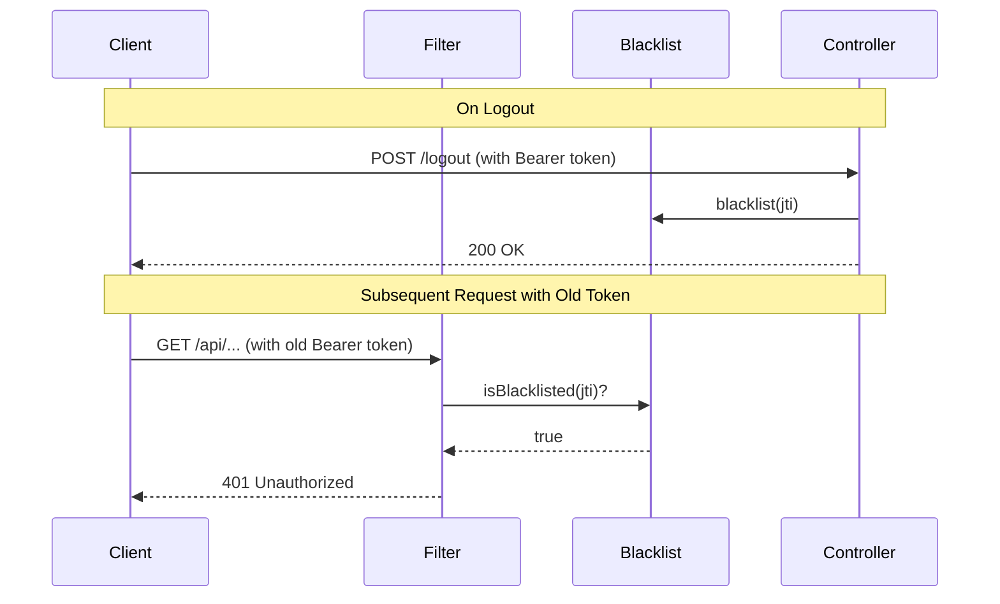

# Walkthrough: JWT Token Blacklist Implementation

## Summary
Implemented JWT token blacklist using Caffeine in-memory cache to enable access token revocation on logout.
---

## How It Works

```mermaid
sequenceDiagram
    participant Client
    participant Filter
    participant Blacklist
    participant Controller

    Note over Client,Controller: On Logout
    Client->>Controller: POST /logout (with Bearer token)
    Controller->>Blacklist: blacklist(jti)
    Controller-->>Client: 200 OK

    Note over Client,Controller: Subsequent Request with Old Token
    Client->>Filter: GET /api/... (with old Bearer token)
    Filter->>Blacklist: isBlacklisted(jti)?
    Blacklist-->>Filter: true
    Filter-->>Client: 401 Unauthorized
```
