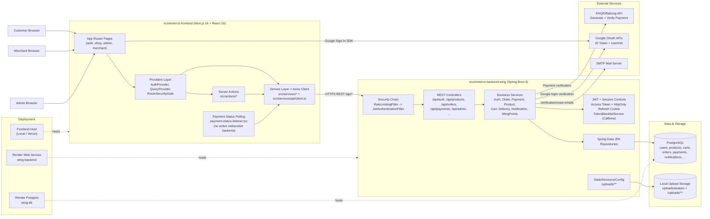

# System Architecture (Whole Project)

```mermaid
flowchart LR
    %% Client roles
    Customer[Customer Browser]
    Merchant[Merchant Browser]
    Admin[Admin Browser]

    subgraph Frontend["ecommerce-frontend (Next.js 16 + React 19)"]
        AppRouter["App Router Pages<br/>(auth, shop, admin, merchant)"]
        Providers["Providers Layer<br/>AuthProvider, QueryProvider,<br/>RouteSecurityGate"]
        Actions["Server Actions<br/>src/actions/*"]
        FEApi["Service Layer + Axios Client<br/>src/services/* + src/services/api/client.ts"]
        Polling["Payment Status Polling<br/>payment-status-listener.tsx<br/>(no active websocket backend)"]
    end

    subgraph Backend["ecommerce-backend-wing (Spring Boot 4)"]
        Security["Security Chain<br/>RateLimitingFilter -> JwtAuthenticationFilter"]
        Controllers["REST Controllers<br/>/api/auth, /api/products, /api/orders,<br/>/api/payments, /api/admin, ..."]
        Services["Business Services<br/>Auth, Order, Payment, Product,<br/>Cart, Delivery, Notification, WingPoints"]
        JWT["JWT + Session Controls<br/>Access Token + HttpOnly Refresh Cookie<br/>TokenBlacklistService (Caffeine)"]
        Repos["Spring Data JPA Repositories"]
        StaticFiles["StaticResourceConfig<br/>/uploads/**"]
    end

    subgraph Data["Data & Storage"]
        Postgres[("PostgreSQL<br/>users, products, carts,<br/>orders, payments, notifications, ...")]
        Uploads[("Local Upload Storage<br/>uploads/avatars + /uploads/**")]
    end

    subgraph External["External Services"]
        Bakong["KHQR/Bakong API<br/>Generate + Verify Payment"]
        Google["Google OAuth APIs<br/>ID Token + UserInfo"]
        Smtp["SMTP Mail Server"]
    end

    subgraph Deploy["Deployment"]
        RenderWeb["Render Web Service<br/>wing-backend"]
        RenderDb["Render Postgres<br/>wing-db"]
        FrontHost["Frontend Host<br/>(Local / Vercel)"]
    end

    Customer --> AppRouter
    Merchant --> AppRouter
    Admin --> AppRouter

    AppRouter --> Providers
    Providers --> Actions
    Providers --> FEApi
    Actions --> FEApi
    Polling --> FEApi

    FEApi -->|HTTPS REST /api/*| Security
    Security --> Controllers
    Controllers --> Services
    Services --> JWT
    Services --> Repos
    Repos --> Postgres
    StaticFiles --> Uploads

    Services -->|Payment verification| Bakong
    Services -->|Google login verification| Google
    Services -->|Verification/reset emails| Smtp
    AppRouter -->|Google Sign-In SDK| Google

    RenderWeb -. hosts .-> Backend
    RenderDb -. hosts .-> Postgres
    FrontHost -. hosts .-> Frontend
```
